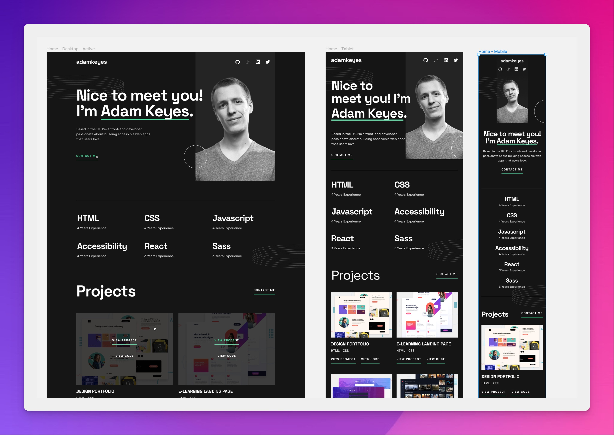

# Frontend Mentor - Single-page developer portfolio

## Welcome

This is [a challenge](https://www.frontendmentor.io/challenges/singlepage-developer-portfolio-bBVj2ZPi-x) from FrontendMentor.

Tech stack I used for this is:
- ReactJS created using Vite
- Typescript (strict mode on)
- Tailwind CSS

See my commits history to see my struggle and how I overcome it.

Live site can be see here: https://fm-developer-portfoilo.vercel.app/

